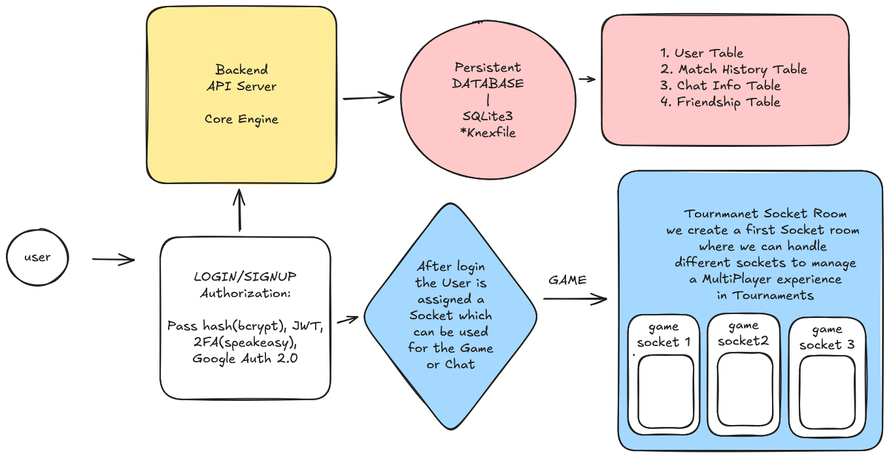

# 42ft_transcendence 🏓

This project is a full-stack web application that implements a real-time multiplayer game, "Transcendence," inspired by the classic game of Pong. It includes a comprehensive user management system, social features, and multiple game modes.

It was our final Project to complete the 42 Wolfsburg Common Core 🎓

Deployed on Render➡️ https://four2ft-transcendence.onrender.com/

## Architecture 🏗️

### Features ✨

- **User Authentication** 🔐: Secure user registration and login system.
  - Standard email/password authentication with password hashing (bcrypt).
  - Google OAuth 2.0 for social login.
  - Two-Factor Authentication (2FA) for enhanced security.
- **User Profiles** 👤:
  - Customizable user profiles with usernames and avatars.
  - View match history and game statistics.
  - Public profiles to view other players' stats.
- **Real-time Multiplayer Gameplay** 🎮:
  - Classic Pong-style gameplay.
  - Real-time matchmaking with other players.
  - Single-player mode against an AI opponent. 🤖
  - Tournament mode for multiple players. 🏆
- **Social Features** 🤝:
  - Friends system: Add and remove friends.
  - Real-time private chat with friends.
- **Dashboard** 🖥️: A central hub to access game modes, view online friends, and manage user settings.

### Backend ⚙️

*   **Framework**: **Fastify** 🚀 is used as the web framework for Node.js, chosen for its high performance and low overhead.
*   **Language**: **Node.js** 🟢 is the runtime environment for the server-side code.
*   **Database** 🗃️:
    *   **SQLite3**: A lightweight, file-based SQL database used for data storage.
    *   **Knex.js**: A SQL query builder used to interact with the database, allowing for portable and clean database code.
*   **Real-time Communication** 📡: **Socket.IO** is used for establishing persistent, real-time, bidirectional communication between the client and server, essential for the gameplay and chat features.
*   **Authentication & Security** 🛡️:
    *   **JSON Web Tokens (JWT)**: Used for creating access tokens to manage user sessions securely.
    *   **bcrypt**: Passwords are hashed using bcrypt before being stored in the database.
    *   **Speakeasy**: A library used to implement Time-based One-Time Passwords (TOTP) for Two-Factor Authentication (2FA).
    *   **Helmet**: A Fastify plugin that sets various HTTP headers to secure the application from common web vulnerabilities.
*   **Module System**: The backend uses **ES Modules (ESM)** (`import`/`export` syntax), which is the modern standard for JavaScript modules.
*   **Object-Oriented Programming (OOP)**: The game logic is structured using classes like `GameEngine`, `Tournament`, and `AIOpponent`, encapsulating state and behavior in a clean, object-oriented way.

### Frontend 🎨

*   **Build Tool/Bundler**: **Vite** ⚡ is used as the frontend build tool, providing a fast development server and optimized production builds.
*   **Language**: **TypeScript** 🔵 is used for writing type-safe frontend code, which helps prevent common errors and improves code quality.
*   **Styling** 💅:
    *   **Tailwind CSS**: A utility-first CSS framework used for rapidly building custom user interfaces.
    *   **Plain CSS**: Used for global styles and base component styling.
*   **Architectural Pattern** 🏛️:
    *   **Single Page Application (SPA)**: The application operates as an SPA. The frontend code dynamically rewrites the current page rather than loading new pages from the server.
    *   **Client-Side Routing**: A custom router is implemented to handle navigation within the SPA without full page reloads.
    *   **Component-Based UI**: The UI is built using a modular, function-based component pattern, where each function is responsible for rendering a specific part of the interface.

## Contact
if you are interested to see the code, contact me in PM

